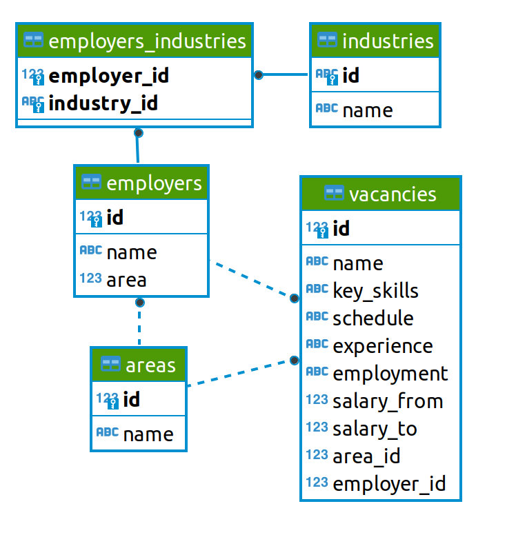

<div align="center">
  
</div>

# <center> Анализ резюме из HeadHunter </center>

## Оглавление
1. [Описание проекта](#Описание-проекта)
2. [Описание данных](#Описание-данных)
3. [Зависимости](#Зависимости)
4. [Установка проекта](#Установка-проекта)
5. [Использование проекта](#Использование-проекта)
6. [Авторы](#Авторы)
7. [Выводы](#Выводы)

## Описание проекта

> Цель: создание модели машинного обучения, которая будет рекомендовать вакансии клиентам агентства, претендующим на позицию Data Scientist. Для этого нам необходимо проанализировать, что из себя представляют данные и насколько они соответствуют целям проекта.

**Организационная информация:**
Проект будет состоять из нескольких частей:
1. Предварительный анализ данных
2. Детальный анализ вакансий
3. Анализ работодателей
4. Предметные анализ
5. Дополнительные исследования

**О структуре проекта:**
* [image](./data/image) - папка с изображениями, необходимыми для проекта
* [html](./data/html) - папка с html графиками, необходимыми для проекта
* [Project-2.ipynb](./Project-2.ipynb) - jupyter-ноутбук, содержащий основной код проекта, в котором демонстрируются методы и подходы решения задачи


## Описание данных
В проекте используется база данных с вакансиями HeadHunter. Структура данных представлена следующими таблицами:
<div align="center">
  
</div>

## Используемые зависимости
* Python (3.13.9):
    * [pandas (2.3.3)](https://pandas.pydata.org)
    * [plotly-express (0.4.1)](https://plotly.express/)
    * [psycopg2 (2.9.11)](https://www.psycopg.org/)
    * [requests (2.32.5)](https://requests.readthedocs.io)
    * [beautifulsoup4 (4.14.2)](https://www.crummy.com/software/BeautifulSoup/bs4/)

## Установка проекта

```
git clone https://github.com/emozdir/project_2.git
```

## Использование
Вся информация о работе представлена в jupyter-ноутбуке [Project-2.ipynb](https://github.com/emozdir/project_2/blob/master/Project-2.ipynb).

## Авторы

* [Екатерина](https://github.com/emozdir)

## Выводы

**В проекте выполнена работа по исследованию базы данных резюме:**
- Предварительный и детальный анализ структуры базы данных;
- Анализ работодателей;
- Предметный анализ данных -  Data Science вакансии.

**Общий вывод по исследованию рынка вакансий Data Science**

Проведенный анализ выявил, что рынок Data Science представляет собой нишевый сегмент с четко выраженными характеристиками:
- Data Science занимает всего 1% от общего рынка и 3.8% от IT-рынка вакансий; 
- Ограниченное количество вакансий для новичков;
- Среднее количество навыков на вакансию (6-7). Python и SQL формируют ядро профессии;
- Пик требований к навыкам приходится на специалистов с опытом 1-6 лет.
- Четкая прогрессия доходов с ростом опыта;
- Москва лидирует по зарплатам среди российских городов, но конкурирует с зарубежными рынками. Кроме того, обнаружены высокие уровни заработной платы некоторых регионах;
- Возможность удвоения-утроения дохода за 3-6 лет профессионального роста.


**В ходе анализа были выявлены следующие проблемы:**
- Большое количество вакансий без указания сферы деятельности компании;
- Нестандартизированные форматы навыков (разный регистр, синонимы);
- Отсутствие унификации в названиях должностей;
- Неполные данные по зарплатам.

**Рекомендации к данным:**
- Внедрение стандартизированных справочников для навыков и специализаций;
- Обязательное указание сферы деятельности компании;
- Обязательное указание зарплатных вилок;
- Сбор данных о времени размещения вакансий.

**Возможные дальнейшие исследования:**

- Тренды изменения зарплат за период;
- Анализ влияния образования на уровень зарплат;
- Исследование вакансий с удаленным типом работы и их оплаты;
- Сравнение российского рынка DS с мировыми тенденциями;
- Исследование влияния размера компании на требования и оплату.

**Заключение:** Совершенствование методологии сбора и обработки данных позволит провести более точные исследования, что особенно важно для цели данного проекта - создания ML модели.
